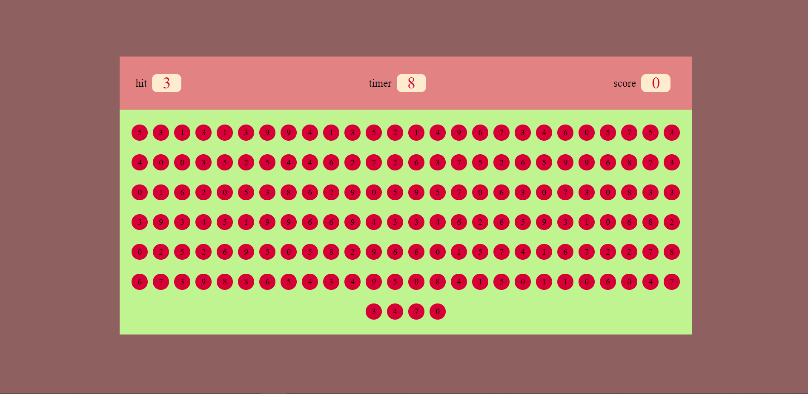

# Simple-Bubble-game-javascript-

### This is a simple javascript based game where player can get the score by hitting the given random number within a time limit...

--- 
### languages and tools 
   - 
   - 
   - 
   - 

--- 

### this function is for runtime. Here i have used setInterval .

```js
   function runTimer() {
     var timeInt = setInterval(() => {
       if (timer > 0) {
         timer--;
         document.querySelector("#timer").textContent = timer;
       } else {
         clearInterval(timeInt);
         document.querySelector("#pbtm").innerHTML = `<h2>Game Over ${score}</h2>`;
       }
     }, 1000);
   }

```
---

### This is hit box function. In the hit box number will be genarate randomly by the Math.random() function.

```js

   function hitBox(){
       hitBubble = Math.floor(Math.random() * 10);
       document.querySelector("#hitBox").textContent = hitBubble;
       
   }

```

---

### This is score function. It will add the score only when the hit and clicked number match.

```js

   function increaseScore(){
   
    score+=10;
    document.querySelector("#score").textContent = score;
     
}

```

---


   


     


